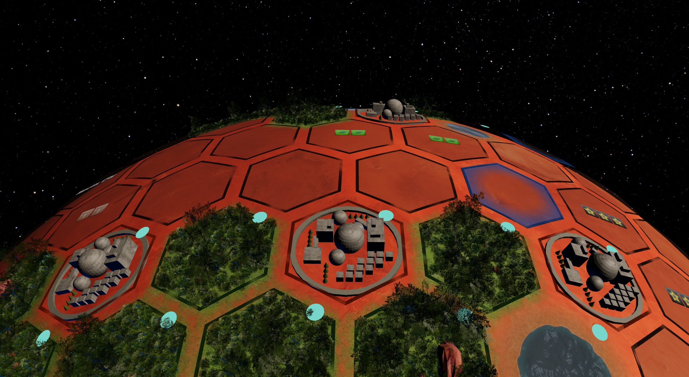

# Terraforming Mars: 3D Edition

> This is an open-source online implementation of the great board game Terraforming mars. It is not affiliated with FryxGames, Asmodee Digital or Steam in any way.
>
> **Buy The Board Game**
>
> The board game is great and we highly recommends purchasing it for personal use.

<p align="center">
  
</p>

## Features

- **3D Game View**: Interactive Mars board with hex-based tile system
- **Real-time Multiplayer**: WebSocket-based multiplayer with Go backend
- **Type Safety**: Automatic TypeScript generation from Go structs

## Project Structure

- `frontend/` - React/TypeScript client with Three.js 3D graphics
- `backend/` - Go server with clean architecture and WebSocket multiplayer
- `Makefile` - Unified development commands

## Quick Start

```bash
make run         # Start both frontend (port 3000) and backend (port 3001)
make frontend    # React development server only
make backend     # Go backend server only
```

## Development Commands

| Command | Description |
|---------|-------------|
| `make run` | Start both servers |
| `make test` | Run all tests |
| `make lint` | Run all linters |
| `make format` | Format all code |
| `make generate` | Generate TypeScript types from Go |
| `make build` | Production builds |

## Technology Stack

**Frontend**: React, TypeScript, Three.js | **Backend**: Go, Gorilla WebSocket
